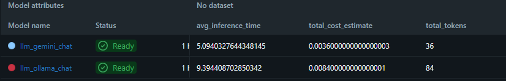
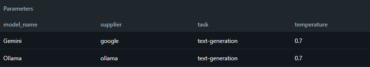
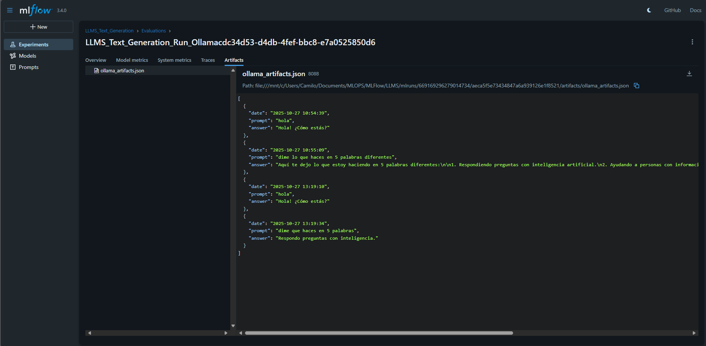
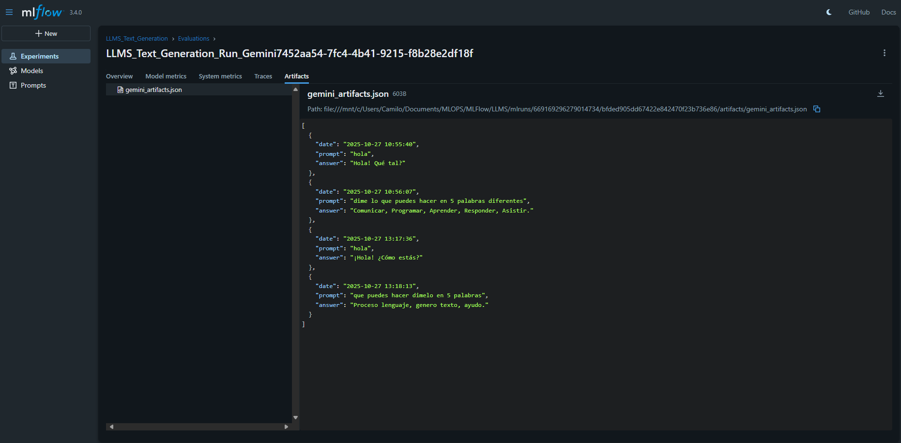
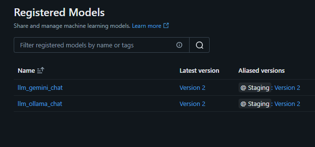
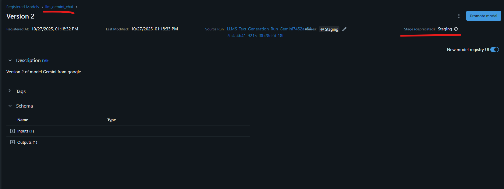
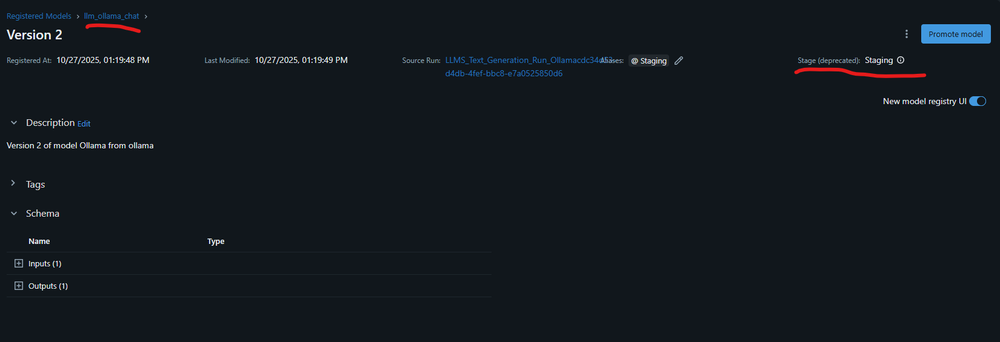

# 🧬 LLMFlowLab – Tracking, Evaluation and Comparison of LLM Models with MLflow

## 🧠 Project Overview
**LLMFlowLab** is a modular, console-based framework designed to **experiment, evaluate, and compare Large Language Models (LLMs)** such as **Gemini (Google)** and **Ollama (local)**.  
It integrates **MLflow** and **GenAI Evaluation** to track, log, and benchmark model runs — storing all parameters, metrics, and artifacts automatically.

---

## 🎯 Objective
Apply **MLflow** to track, compare, and register executions of **Large Language Models (LLMs)** — specifically **Gemini (Google)** and **Ollama (local)** — logging their parameters, metrics, and artifacts, and comparing their performance through the MLflow interface.  
Additionally, the framework uses **MLflow GenAI evaluators** to assess model responses on **Correctness** and **Safety**.

---

## 📁 Project Structure

```
📦 LLMFlowLab
├── main.py                # Entry point – runs the interactive console app
├── handler.py             # Menu controller (chat, evaluate, info)
├── Models.py              # Model definitions (Gemini, Ollama, Factory)
├── Text.py                # Text processing (token count, cost, language)
├── artifacts/             # Logged prompts and responses
│   ├── gemini_artifacts.json
│   └── ollama_artifacts.json
├── info_by_model/         # Model info (parameters + metrics)
│   ├── gemini_info.json
│   └── ollama_info.json
└── models/
    └── lid.176.bin        # fastText model for language detection
```

---

## ⚙️ Technologies Used

- **Python 3.10+**
- **MLflow & MLflow GenAI** (tracking, registry, and evaluation)
- **Ollama API** (local Llama3 model)
- **Google Gemini API**
- **fastText** (language detection)
- **tiktoken** (token counting)
- **colorama** (colored CLI interface)
- **pandas** (for dataset and evaluation management)
- **json / os / time** (for artifacts persistence and logging)

---

## 🚀 How to Run the Project

1. **Install dependencies**
   ```bash
   pip install mlflow google-genai fasttext tiktoken colorama pandas
   ```

2. **Run the main script:**
   ```bash
   python main.py
   ```

3. **Select the mode:**
   ```
   1 - Chat (with MLflow tracking)
   2 - Evaluate (GenAI MLflow)
   3 - Show info (model comparison)
   4 - Exit
   ```

4. **Enter prompts** and observe the generated responses — all runs are automatically logged in MLflow.

<div align="center">
  
  <p><i>Evidence: Console execution selecting models and generating responses</i></p>
</div>

---

## 💬 Chat Mode

- Starts a **live conversation** with the selected LLM (Gemini or Ollama).  
- Tracks parameters, metrics, and artifacts per session.  
- Automatically registers models in the **MLflow Model Registry** and promotes them to **“Staging”**.

```python
mlflow.set_experiment("LLMS_Text_Generation")
with mlflow.start_run(run_name=f"Chat_{model.name}") as run:
    mlflow.log_params(model.get_parameters())
    mlflow.log_metrics(model.get_metrics())
```

---

## 🧠 Evaluation Mode (GenAI)

Uses MLflow’s **GenAI evaluation** to score LLM responses based on correctness and clarity.

```python
eval_dataset = [{
  "inputs": {"question": "Briefly explain what you can do as an AI agent."},
  "expectations": {
    "expected_response": "I assist, reason, generate, and adapt to user goals.",
    "guidelines": "Respond briefly and clearly."
  }
}]

result = evaluate(
    data=eval_dataset,
    predict_fn=predict,
    scorers=[Correctness()]
)
```

📊 Results are logged in MLflow and can be reviewed through the web UI.

---

## 📊 Logged Metrics

| Metric | Description |
|----------|--------------|
| `avg_inference_time` | Average model inference latency |
| `total_tokens` | Total number of generated tokens |
| `total_cost_estimate` | Estimated cost per interaction (simulated) |

<div align="center">
  
  <p><i>Evidence: Metrics comparison between Gemini and Ollama in MLflow</i></p>
</div>

---

## 🧾 Logged Parameters

| Parameter | Description |
|------------|--------------|
| `model_name` | Model name (Gemini / Ollama) |
| `supplier` | Provider (Google / Ollama) |
| `task` | Type of task (`text-generation`) |
| `temperature` | Controls creativity in generation |

<div align="center">
  
  <p><i>Evidence: Parameters logged in MLflow</i></p>
</div>

---

## 📦 Logged Artifacts

All prompts and responses are stored as artifacts in JSON format, ensuring reproducibility.

```json
[
  {
    "date": "2025-10-27 11:20:15",
    "prompt": "Explain what MLflow is",
    "answer": "MLflow is a tool to manage the lifecycle of ML models..."
  }
]
```

<div align="center">
  
  <p><i>Evidence: Artifacts file containing prompts and responses – Ollama</i></p>
</div>

<div align="center">
  
  <p><i>Evidence: Artifacts file containing prompts and responses – Gemini</i></p>
</div>

---

## 🧩 Model Registry

Each model is registered as:
- `llm_gemini_chat`
- `llm_ollama_chat`

And automatically promoted to the **`Staging`** stage with alias and version control:

```python
set_stage_and_alias(client, name=mv.name, version=mv.version, stage="Staging")
```

<div align="center">
  
  <p><i>Evidence: Models registered in MLflow</i></p>
</div>

<div align="center">
  
  <p><i>Evidence: Model Gemini transitioned to Staging in MLflow</i></p>
</div>

<div align="center">
  
  <p><i>Evidence: Model Ollama transitioned to Staging in MLflow</i></p>
</div>

---

## 🗂️ Information Mode

Displays all stored metadata for each model:
- Parameters  
- Metrics  
- Artifact history (prompt + response)  

Stored in:
```
/info_by_model/gemini_info.json
/info_by_model/ollama_info.json
```

---

## 🔍 Comparative Analysis

### Objective
Compare tracked runs and evaluate LLM performance based on latency, token usage, and accuracy.

<div align="center">
  
  <p><i>Evidence: Metrics comparison in MLflow UI</i></p>
</div>

| Metric | Gemini | Ollama |
|---------|---------|---------|
| Avg. Inference Time | ✅ Lower | ⬆️ Higher |
| Total Tokens | 🔵 Fewer | 🟢 More |
| Cost Estimate | 💰 Lower | 💰 Higher (simulated) |

---

### 📈 Results Summary

| Question | Answer |
|-----------|---------|
| Which model had the lowest average latency? | 🟢 Gemini |
| Which generated more tokens? | 🔵 Ollama |
| What can be improved? | 🔧 Prompt engineering, temperature tuning, and local optimization |

---

## 💡 Conclusions

- **MLflow** enables comprehensive tracking of LLM experiments (parameters, metrics, artifacts).  
- **Gemini** achieved lower inference time, while **Ollama** produced richer responses.  
- The system provides a unified pipeline for **evaluation, registry, and comparison**.  
- Scalable to include more models, evaluation metrics, and fine-tuning workflows.

---

## 👨‍💻 Author

**Camilo Andrés Ramos Cotes**  
📧 **camutoxlive20@gmail.com**  
🧱 *MLOps Project – Tracking, Evaluation, and Comparison of LLM Models with MLflow*
